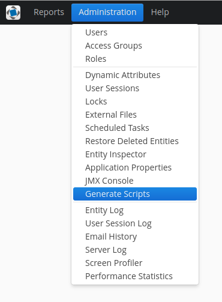
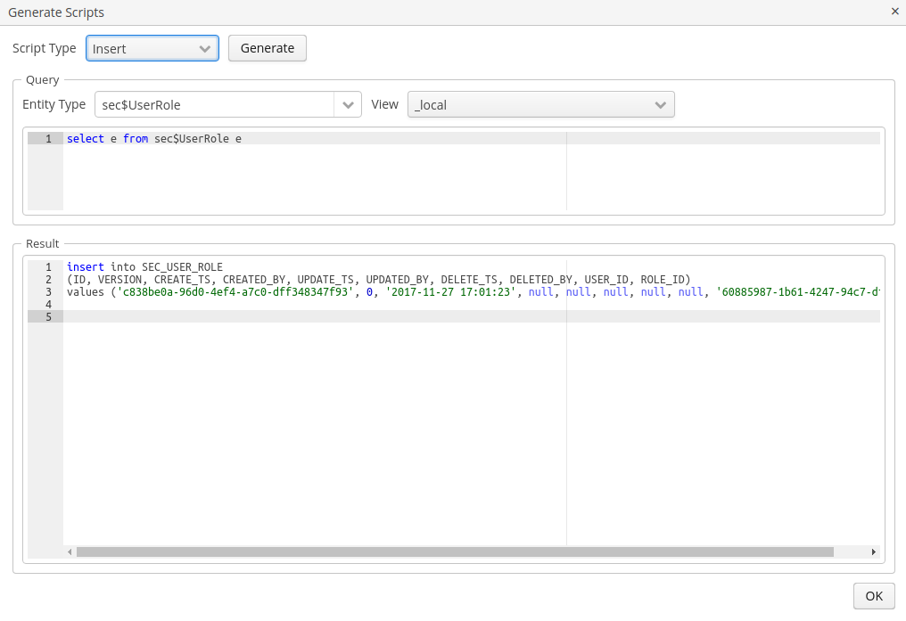
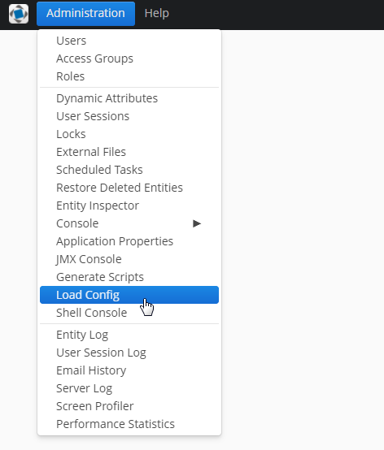
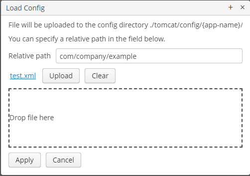
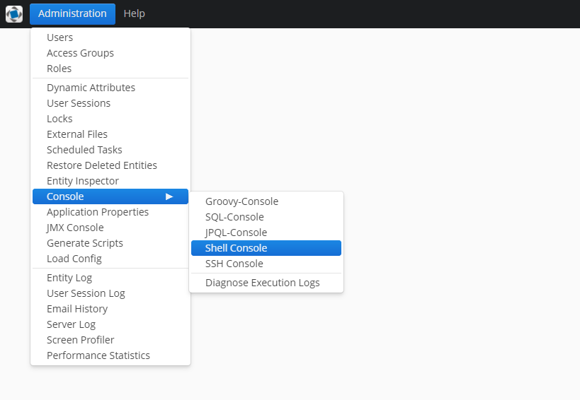
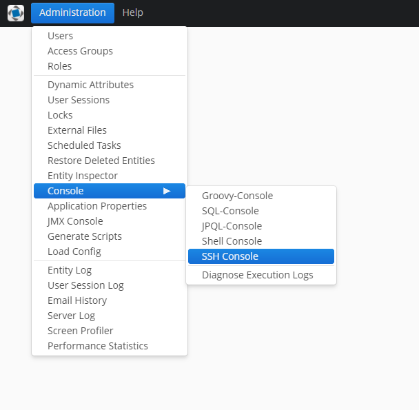

# CUBA Platform Component - Admin Tools

The component comprises the following parts:
* [Generator of SQL scripts](#sql-scripts-generator);
* Auto Import subsystem;
* JPQL console;
* SQL console;
* Groovy console;
* Shell Console;
* SSH Console.

## Installation

The process of the component installation consists of several steps and is described below.

1. Add the following maven repository `https://repo.cuba-platform.com/content/repositories/premium-snapshots`
to the build.gradle file of your CUBA application:
   
     ```groovy
     buildscript {
           
        //...
            
        repositories {
            
           // ...
            
           maven {
              url  "https://repo.cuba-platform.com/content/repositories/premium-snapshots"
           }
        }
            
        // ...
     }
     ```

2. Select a version of the add-on which is compatible with the platform version used in your project:

| Platform Version | Add-on Version |
| ---------------- | -------------- |
| 6.8.1            | 0.1-SNAPSHOT   |

Add a custom application component to your project:
   
   * Artifact group: `com.haulmont.addon.admintools`
   * Artifact name: `cuba-at-global`
   * Version: *add-on version*
   
**Note:** To activate the Auto Import subsystem, additional configurations are required (for more details, please refer to
this [paragraph](#creating-an-auto-import-configuration-file)).
  
## SQL Scripts Generator

This functionality of the Admin Tools component allows generating SQL scripts for selected entities of a project.



JPQL requests are used for entity selection. Start by specifying a metaclass, view and type of a script to be generated 
(insert, update, insert update). Selecting a metaclass automatically generates a JPQL request:

```sql
select e from example$Entity e
```



After that, SQL scripts of the specified type are generated for the found entities. If there are no results found, then 
the system shows a corresponding notification: 'No data found'.

## Auto Import

The AutoImport subsystem is designed to preconfigure servers and transfer data among servers. The process is launched 
automatically during the server start/restart. 

For importing data, specify a path to a zip-archive in a configuration file. If an archive with the same name has already
 been processed, then it is not considered by the system and skipped.

The component comprises ready-made solutions for importing security roles and access groups. The __Export as ZIP__ button 
allows generating archives containing the required data about security roles or access groups. The user can export 
project entities to a zip-archive or json using Entity Inspector (learn more about this functionality [here](https://doc.cuba-platform.com/manual-6.8/entity_inspector.html)). 

#### Creating an auto-import configuration file

1. Configuration file example:
       
     ```xml
     <?xml version="1.0" encoding="UTF-8" standalone="no"?>
     <auto-import>
         <!--default processor-->
         <auto-import-file path="com/company/demoforadmintoolscomponent/Roles.zip" bean="admintools_DefaultAutoImportProcessor"/>
         <auto-import-file path="com/company/demoforadmintoolscomponent/Groups.json" bean="admintools_DefaultAutoImportProcessor"/>
        
     </auto-import>
     ```

     Where path is a path to the data file, bean/class a processor. Bean = [bean name], class [class path].
   
2. Add the `admin.autoImportConfig` property to `app.properties` and, additionally, specify the configuration file path.

### Custom import processor

A class-processor is responsible for file processing and can be implemented as a bean or a simple java-class. 
If necessary, you can provide a custom implementation of a processor for any entity within a project by applying the 
AutoImportProcessor interface.

#### Creating a custom import processor

To create a custom processor, the next steps should be taken:

1. Create a class that implements the AutoImportProcessor interface
   
     ```java
     @Component("admintools_ReportsAutoImportProcessor")
     public class ReportsAutoImportProcessor implements AutoImportProcessor {
         @Inject
         protected ReportService reportService;
         @Inject
         protected Resources resources;
     
         @Override
         public void processFile(String filePath) throws Exception {
             try (InputStream inputStream = resources.getResourceAsStream(filePath)) {
                 byte[] fileBytes = IOUtils.toByteArray(inputStream);
                 reportService.importReports(fileBytes);
             }
         }
     }
     ```
   
2. If a processor is implemented as a java bean, then specify a component name and a path
to the required zip-archive in a configuration file. If a processor is implemented as a class,
then provide a path to the class
   
     ```xml
     <?xml version="1.0" encoding="UTF-8" standalone="no"?>
     <auto-import>
         ...
      
         <auto-import-file path="com/company/demoforadmintoolscomponent/Reports.zip" bean="admintools_ReportsAutoImportProcessor"/>
         ...
     </auto-import>
     ```
   
### Additional information.

#### Logging

See logging information in the `app.log` file.

##### Successful import

```
com.haulmont.addon.admintools.listeners.AutoImportListener - Importing file com/company/autoimporttest/Roles.zip by bean autoimport_RolesAutoImportProcessor
...
com.haulmont.addon.admintools.processors.DefaultAutoImportProcessor - Successful importing file com/company/autoimporttest/Roles.zip
```

##### Incorrect name of a processor

```
com.haulmont.addon.admintools.listeners.AutoImportListener - Importing file com/company/demoforadmintoolscomponent/Groups.zip by bean autoimport_InvalidAutoImportProcessor
...
com.haulmont.addon.admintools.listeners.AutoImportListener - org.springframework.beans.factory.NoSuchBeanDefinitionException: No bean named 'autoimport_InvalidAutoImportProcessor' available
```

```
com.haulmont.addon.admintools.listeners.AutoImportListener - Importing file com/company/demoforadmintoolscomponent/Groups.zip by class com.example.InvalidAutoImportProcessor ... com.haulmont.addon.admintools.listeners.AutoImportListener - java.lang.ClassNotFoundException: com.example.InvalidAutoImportProcessor
```

##### Uploaded archive is not found

```
com.haulmont.addon.admintools.listeners.AutoImportListener - Importing file com/example/invalid.zip by bean autoimport_ReportsAutoImportProcessor
com.haulmont.addon.admintools.processors.ReportsAutoImportProcessor - File com/example/invalid.zip not found.
```

## JPQL Console
JPQL Console allows interacting with an application database by using JPQL. 


Request results are displayed in the table and can be exported to an Excel file if required. Note that collection attributes
are not shown in the Result table.
### JPQL Console Security
By default, only SELECT requests can be executed. If there is a need to send UPDATE and/or DELETE requests, then the 
*runtime-diagnose.sql.allowDataManipulation* application property has to be set to 'true' 
(**Menu**: Administration → Application properties → runtime-diagnose → sql → runtime-diagnose.sql.allowDataManipulation).

To find out more about the Runtime Diagnose component, please get acquainted with [this documentation](https://github.com/mariodavid/cuba-component-runtime-diagnose/blob/master/README.md)

## Load Config
Using the Load Config functionality it is possible upload configuration files and various scripts to a configuration 
directory right from the system UI without stopping the application. 



The location of the configuration directory is determined by the `cuba.confDir` application property. Additionally, you can
specify a relative path in the corresponding field.



When trying to upload a config that already exists in the configuration directory or if names of two configs coincide, 
a message requesting to confirm file replacement appears.


## Shell Console
Shell Console is a functionality for running UNIX shell scripts (sh files). It allows operating with data efficiently and 
enables to run various OS commands right from the application UI. Note that this functionality is available only if you 
use UNIX systems.




The screen consists of two sections: the first section allows inputting and managing scripts and the second one provides functionalities
for operating with results.

The toolbar of the first section comprises action buttons that enable to run scripts, cancel the operation, clear input data
and generate diagnose file requests. 
In addition to the console, there is the 'Arguments' field for specifying positional parameters.

The second section allows viewing results of running scripts, saving and clearing them.

When scripts are run, the system generates temporary files, which are stored in the `.\tomcat\temp` directory. Note
that the component does not remove these files automatically. 

## SSH Console
SSH Console allows operating network services on remote servers right from the application UI. Note that this functionality
is available only for UNIX systems.
 
 
 
Before connecting to a remote server, it is required to specify credentials and a hostname in the corresponding section.
After that, use action buttons to connect to a server via SSH or to disconnect. The toolbar of SSH Console also comprises
the __Fit__ button, which allows managing the size of a terminal, and a progress bar.

### Known issues

- Utility `screen` doesn't work in the console