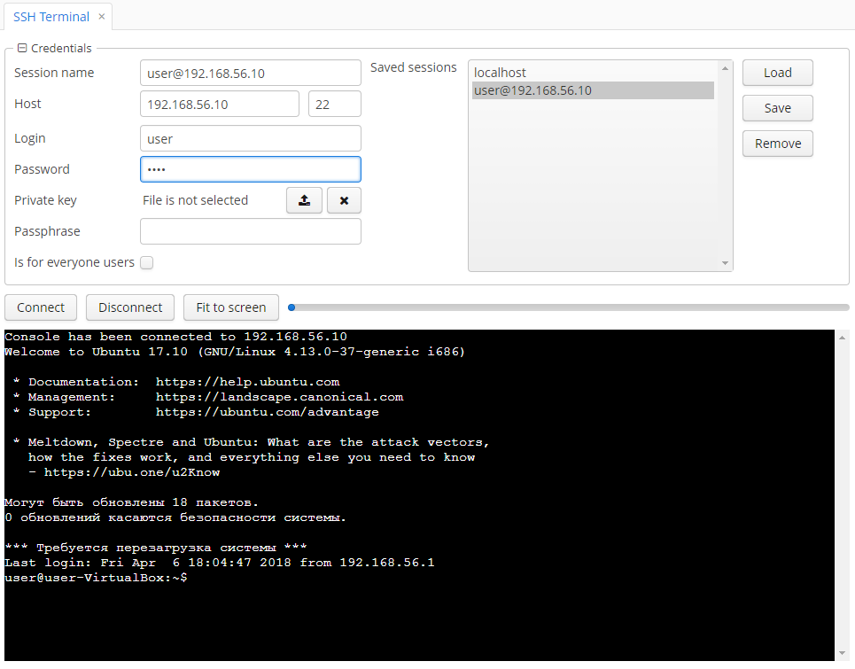

<p>
    <a href="http://www.apache.org/licenses/LICENSE-2.0"></a>
    <a href="https://travis-ci.org/cuba-platform/admin-tools-addon"></a>
</p>

- [Overview](#overview)
- [Installation](#installation)
  - [Enabling and Disabling Components](#enabling-and-disabling-components)
- [Add-on Components](#add-on-components)
 - [Runtime Diagnose Components](#runtime-diagnose-components)
 - [SQL Script Generator](#sql-script-generator)
 - [Shell Executor](#shell-executor)
 - [SSH Terminal](#ssh-terminal)
 - [Config Loader](#config-loader)
 - [Console Script Loader](#console-script-loader)
 - [Auto Import Subsystem](#auto-import-subsystem)
 - [Tomcat JMX Bean](#tomcat-jmx-bean)

# Overview

The add-on extends the capabilities of CUBA applications with runtime diagnostics and management tools. You can use the add-on to interactively inspect the running application, interact with the database and generate SQL scripts, send OS commands (only for Unix systems) and connect to remote servers.

Auto Import Subsystem provides preconfiguring servers and transferring data among servers automatically during the server start/restart.

See [sample application](https://github.com/cuba-platform/admin-tools-demo), using this component.

# Installation

1. Open your application in CUBA Studio.

2. Edit *Project properties*.

3. Click the *Plus* button in the *App components* section of the *Main* tab.

4. Specify the coordinates of the component in the corresponding field as follows: group:name:version.

  - Artifact group: *com.haulmont.addon.admintools*
  - Artifact name: *cuba-at-global*
  - Version: *add-on version*  

When specifying the component version, you should select the one, which is compatible with the platform version used in your project.

| Platform Version | Add-on Version |
| ---------------- | -------------- |
| 7.0.x            | 1.3.1          |
| 6.10.x           | 1.2.1          |
| 6.9.x            | 1.1.3          |
| 6.8.x            | 1.0.5          |

5. Click *OK* to confirm the operating.

## Enabling and Disabling Components
Each part of the add-on can be enabled or disabled. It can be turned on or off explicitly or by using a corresponding application property. By default, all components are enabled, except [Auto Import Subsystem](#auto-import-subsystem).

You can turn on *Auto Import Subsystem* in the middleware block, writing the next property in the file `app.properties`:

```properties
admintools.autoImport.enabled = true
```

You can enable/disable the other components in the client block,  writing the next properties in the file `web-app.properties`:
```properties
admintools.groovyConsole.enabled = false
admintools.sqlConsole.enabled = false
admintools.jpqlConsole.enabled = false
admintools.diagnoseExecutionLog.enabled = false

admintools.scriptGenerator.enabled = false
admintools.shellExecutor.enabled = false
admintools.sshTerminal.enabled = false
admintools.configLoader.enabled = false
admintools.consoleScriptLoader.enabled = false
```

# Add-on Components

## Runtime Diagnose Components
Components *Groovy Console*, *JPQL Console*, *SQL Console* and *Diagnose Execution Logs* are imported
from the [Runtime Diagnose Component](https://github.com/mariodavid/cuba-component-runtime-diagnose).

The following enhancements have been made for this component:

* Added an ability to import scripts from ZIP files for *Groovy Console*, *JPQL Console* and *SQL Console*.
* Added the autocomplete for providing suggestions  while you type JPQL request in *JPQL Console*.

## SQL Script Generator

This part of the component enables generating SQL scripts for selected project entities.


JPQL requests are used for entity selection. Start by specifying a metaclass, view and type of a script to be generated
(insert, update, insert update). Selecting a metaclass automatically generates a JPQL request:

```sql
select e from example$Entity e
```


After that, SQL scripts of the specified type are generated for the found entities. If no results are found,
the system shows a corresponding notification. You can limit the number of entities to be loaded using
the *Entity Limit* field.

*Note:* if you cancel the process, it will not be stopped on the middleware.

## Shell Executor
Shell Executor is designed for running shell scripts. It allows you to run various OS commands from the application UI.
Note that this functionality is available only on Unix-like systems.


The screen consists of two sections: the first section allows a user to input and manage scripts and the second one enables working with results.

When scripts are run, the system generates temporary files which are stored in the `tomcat/temp` directory. Note
that the component does not remove these files automatically.

## SSH Terminal

SSH Terminal is designed for working with remote servers from the application UI.

 

Before connecting to a remote server, it is required to specify credentials and a hostname in the corresponding section.
As an alternative, use a private key and a passphrase for a connection instead of a password. After that, use action buttons to connect to a server.
The toolbar of *SSH Console* contains also the _Fit_ button, which allows a user to change the size of the terminal.

Connection parameters can be stored in the database (except the password and the passphrase). For saving, removing and loading
connection parameters, use corresponding buttons. By default, connection parameters are saved only for the current user
if the checkbox *Is for everyone* isn't checked. All available connection parameters are shown in the *Saved Sessions* list.



### Known Issues

- The `screen` utility does not work in the terminal.

## Config Loader

Using the Config Loader, it is possible to upload configuration files and various scripts to a [configuration
directory](https://doc.cuba-platform.com/manual-latest/conf_dir.html) from the system UI without stopping the application.


The configuration directory is located at `tomcat/conf`. Additionally, you can specify a relative path
in the corresponding field.


When trying to upload a file that already exists in the configuration directory or if names of two files coincide,
a message requesting to confirm file replacement appears.


## Console Script Loader


Console Script Loader is used to import scripts in the [Groovy, JPQL and SQL consoles](#runtime-diagnose-components).
Upload ZIP in the corresponding field and it redirects to a necessary console with a script in a text field.


## Auto Import Subsystem

The AutoImport subsystem is designed to preconfigure servers and transfer data among servers. The process is launched
automatically during the server start/restart.

For importing data, specify a path to a ZIP archive or a JSON file in the configuration file. If an archive with the same name has already
 been processed, then it is not considered by the system and skipped.

There are several options for exporting various entities:

* Security roles and access groups can be exported using the __Export as ZIP__  or __Export as JSON__ actions available on the *Roles* and *Access Groups* screens.
* Arbitrary entities can be exported using the __Export as ZIP__  or __Export as JSON__ actions available on the *Administration > Entity Inspector* screen.

### Creating an Auto Import Configuration File

1. Example of a configuration file:

     ```xml
     <?xml version="1.0" encoding="UTF-8" standalone="no"?>
     <auto-import>
         <!--default processor-->
         <auto-import-file path="com/company/example/Roles.zip" bean="admintools_DefaultAutoImportProcessor"/>
         <auto-import-file path="com/company/example/Groups.json" class="com.company.example.SomeProcessor"/>
     </auto-import>
     ```

     Where `path` is a path to the data file, `bean`/`class` — a processor.

2. Add the `admintools.autoImportConfig` property to `app.properties` and specify the path to the configuration file.
For example:

    ```properties
    admintools.autoImportConfig = +com/company/example/auto-import.xml
    ```
3. Add `admintools.autoImport.enabled=true` property to `app.properties` file.

### Custom Import Processor

A processor is responsible for file processing and can be implemented as a bean or a simple Java class.
If necessary, you can provide a custom implementation of a processor for any entity within the project by implementing the
`AutoImportProcessor` interface.

#### Creating a Custom Import Processor

1. Create a class that implements the `AutoImportProcessor` interface.

     ```java
     @Component("admintools_ReportsAutoImportProcessor")
     public class ReportsAutoImportProcessor implements AutoImportProcessor {
         @Inject
         protected ReportService reportService;
         @Inject
         protected Resources resources;

         @Override
         public void processFile(String filePath) throws Exception {
             try (InputStream inputStream = resources.getResourceAsStream(filePath)) {
                 byte[] fileBytes = IOUtils.toByteArray(inputStream);
                 reportService.importReports(fileBytes);
             }
         }
     }
     ```

2. If a processor is implemented as a Spring bean, specify the bean name in the configuration file. If a processor is implemented as a simple class,
specify its FQN.

     ```xml
     <?xml version="1.0" encoding="UTF-8" standalone="no"?>
     <auto-import>
         ...
         <auto-import-file path="com/company/example/Reports.zip" bean="admintools_ReportsAutoImportProcessor"/>
		 <auto-import-file path="com/company/example/Reports.json" class="com.company.example.ReportsAutoImportProcessor"/>
         ...
     </auto-import>
     ```

### Logging

Logging information is available in the `app.log` file. See examples of the log output below.

#### Successful import

```
com.haulmont.addon.admintools.core.auto_import.AutoImporterImpl - file com/company/autoimporttest/Roles.zip is importing
...
com.haulmont.addon.admintools.core.auto_import.AutoImporterImpl - file com/company/autoimporttest/Roles.zip has been imported
```

#### Incorrect name of a processor

```
com.haulmont.addon.admintools.core.auto_import.AutoImporterImpl - file com/company/autoimporttest/Roles.zip is importing
...
com.haulmont.addon.admintools.core.auto_import.AutoImporterImpl - org.springframework.beans.factory.NoSuchBeanDefinitionException: No bean named 'autoimport_InvalidAutoImportProcessor' available
```

```
com.haulmont.addon.admintools.core.auto_import.AutoImporterImpl - file com/company/autoimporttest/Roles.zip is importing
...
com.haulmont.addon.admintools.core.auto_import.AutoImporterImpl - java.lang.ClassNotFoundException: com.example.InvalidAutoImportProcessor
```

#### Uploaded archive is not found

```
com.haulmont.addon.admintools.core.auto_import.AutoImporterImpl - file com/company/autoimporttest/Roles.zip is importing
com.haulmont.addon.admintools.core.auto_import.AutoImporterImpl - File not found by the path com/example/invalid.zip
```

### Known Issues

Class `com.haulmont.cuba.core.app.importexport.EntityImportViewBuilder` is extended by class `ExtendedEntityImportViewBuilder`
to build JSON if ONE_TO_MANY meta property has type ASSOCIATION.

## Tomcat JMX Bean
Tomcat JMX is a management bean which allows you to execute operations on Tomcat server currently running the application.
It is supported on Windows and Unix-like operating systems. The bean can be accessed from *Administration → JMX Console* screen.
Start searching by the object name 'Tomcat' and the domain 'cuba-at' and you will find the *TomcatWeb* MBean.
If the middleware block is running on the same Tomcat, you will see also the *TomcatCore* MBean. In this case, you can use either of them.


Tomcat JMX bean allows you to execute the following operations:

* `getTomcatAbsolutePath` - returns an absolute path to the Tomcat directory;
* `shutdown` - shutdowns the Tomcat process;
* `reboot` - shutdowns the existing Tomcat process and runs a new one;
* `runShellScript` - runs a script in the Tomcat directory with the following arguments:
    1. `Path` - path to a script relative to the Tomcat root directory;
    2. `Arguments` - arguments that should be passed to the script.


